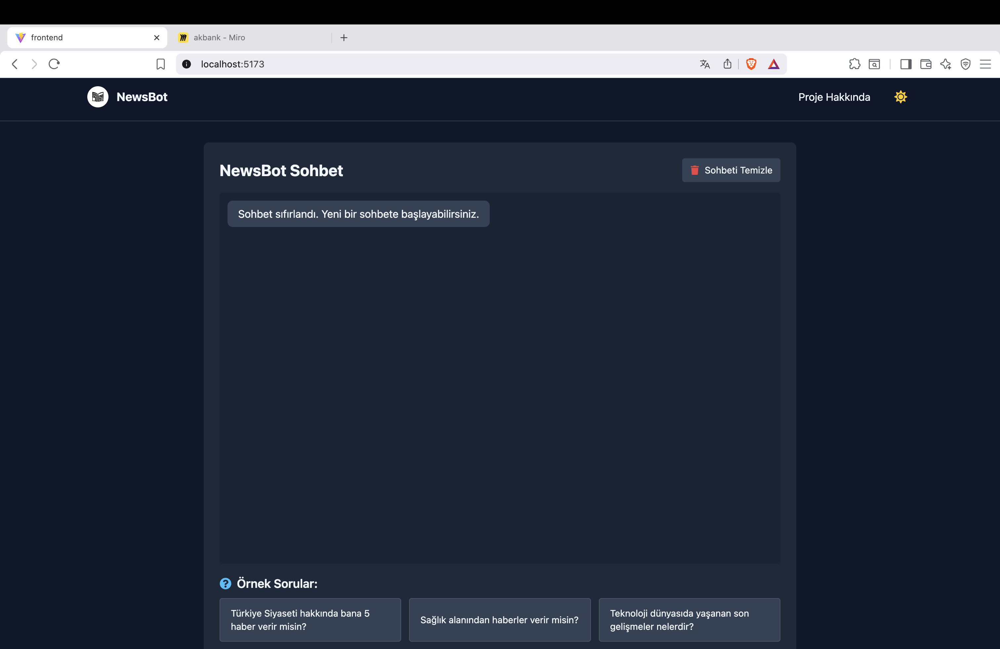

# RAG Tabanlı Chatbot Projesi – Akbank GenAI Bootcamp

## Proje Özeti

Bu proje, Türkçe haber metinlerinden oluşan büyük bir bilgi havuzunu kullanarak, kullanıcıların doğal dilde sordukları sorulara doğru, bağlama uygun ve hızlı yanıtlar verebilen RAG (Retrieval-Augmented Generation) tabanlı bir chatbot sistemidir.

### Hedeflenen Problemler

- **Veri Erişilebilirliği**: 42.000 haberlik bir arşivde elle arama yapma zorluğunu ortadan kaldırır.
- **Doğru Bilgiyi Bulma**: Geleneksel arama motorlarının getirdiği sonuçlardan ziyade, doğrudan özetlenmiş bilgi sunar.
- **Bilgi Kısıtlılığı**: Genel modellerin bilmediği özel verileri kullanarak alanında uzmanlaşmış yanıtlar verir.

---

## RAG (Retrieval-Augmented Generation) Nedir?

RAG, büyük dil modellerinin (LLM) bilgi eksikliğini gidermek için dış kaynaklardan bilgi alarak (Retrieval) bu bilgilerle zenginleştirilmiş (Augmented) yanıtlar üreten bir yapay zeka tekniğidir. Bu projede, Türkçe haber içerikleri vektör veritabanında saklanır ve kullanıcı sorularına bu bilgilerle yanıt verilir.

### Kullanıcı RAG Teknolojisini Nasıl Kullanır?

1. **Soru Sor**: Örn. “Son teknoloji haberleri neler?”
2. **Anında Yanıt Al**: Model, en uygun içerikleri bulup özet yanıt sunar.
3. **Kaynak Tabanlı Bilgi**: Yanıtlar gerçek haber içeriklerine dayanır.
4. **Kategoriye Özel Sorgu**: Spor, ekonomi, teknoloji gibi filtrelenmiş aramalar yapılabilir.

---

## Neden RAG?

| Özellik               | Geleneksel NLP       | RAG                        |
|-----------------------|----------------------|----------------------------|
| Güncel Bilgi          | Sınırlı              | Vektör DB güncellenebilir |
| Halüsinasyon          | Yüksek risk          | Kaynak tabanlı, düşük risk|
| Domain Spesifik       | Zor, maliyetli       | Kolay, veriyle entegre    |
| Maliyet               | Yüksek               | Düşük                     |
| Şeffaflık             | Düşük                | Kaynak bilgisi içerir     |

### Bu Projede Neden RAG?

- Büyük haber arşivini verimli kullanma
- Güncellenebilir vektör veritabanı
- Düşük maliyetli çözüm (LLM + embedding)
- Yüksek doğruluk ve güvenilirlik
- Kategori bazlı sorgu desteği

---

## Veri Seti

- **Kaynak**: [Kaggle - 42 Bin Haber Veri Kümesi](https://www.kaggle.com/datasets)
- **İçerik**: 42.000 Türkçe haber metni, 13 kategori (teknoloji, spor, ekonomi, vb.)
- **Veri Formatı**:
  - `news/` klasöründe .txt formatlı haberler
  - `okubeni.doc`: Bilgilendirme dosyası
- **Dil**: Türkçe
- **İşleme Süreci**:
  - Noktalama/sayı/özel karakter temizliği
  - Küçük harfe dönüştürme
  - Tokenizasyon
  - Chunk'lama (~500 karakter)
  - Metadata (kategori, tarih, başlık)

---

## Kullanılan Teknolojiler

### Backend (FastAPI)

- **FastAPI**: Modern ve hızlı API framework
- **LangChain**: RAG pipeline yönetimi
- **ChromaDB**: Vektör veritabanı
- **HuggingFace**: Embedding modeli
- **Ek Kütüphaneler**: pandas, dotenv, kagglehub

### Frontend (React)

- **React**: SPA (Single Page Application)
- **Axios**: API bağlantısı
- **Vite**: Hızlı geliştirme ortamı
- **TailwindCSS**: Responsive tasarım
- **React Router**: Sayfa yönlendirme

---

## Proje Kurulum ve Çalıştırma Rehberi

---

## Gereksinimler

Bu projeyi çalıştırmak için aşağıdaki araçların sisteminizde kurulu olması gerekmektedir:

- **Git**  
- **Python 3.10** ve üzeri  
- **Node.js 18** ve üzeri  
- **npm** (Node paket yöneticisi)

### macOS için temel araçların kurulumu

macOS kullanıyorsanız, Homebrew aracılığıyla aşağıdaki komutlarla gerekli yazılımları yükleyebilirsiniz:

```bash
brew install git python@3.11 node
```

### Windows için temel araçların kurulumu (PowerShell)

Windows kullanıcıları için Windows Paket Yöneticisi (winget) ile gerekli yazılımları yükleme komutları:

```bash
winget install --id Git.Git -e
winget install --id Python.Python.3.11 -e
winget install --id OpenJS.NodeJS.LTS -e
```

## Repo'nun Klonlanması

Projeyi kendi bilgisayarınıza klonlamak için terminal veya PowerShell üzerinde şu komutları kullanabilirsiniz:

```bash
git clone https://github.com/Alper-Bilgin/Akbank_Generative_AI.git
cd Akbank_Generative_AI
```
## Backend Kurulumu

Backend kısmını çalıştırmak için öncelikle Python sanal ortamı oluşturup, bağımlılıkları yükleyin.

### macOS İçin

```bash
cd backend

# Sanal ortam oluşturma ve aktive etme
python3 -m venv .venv
source .venv/bin/activate

# pip güncelleme ve bağımlılıkların yüklenmesi
python -m pip install --upgrade pip
pip install -r requirements.txt

# Ortam değişkenleri dosyasını oluşturma (varsa)
# cp .env.example .env

# Backend sunucusunu başlatma (FastAPI örneği)
# uvicorn main:app --reload --host 0.0.0.0 --port 8000

```
### Windows İçin (PowerShell)

```bash
cd backend

# Sanal ortam oluşturma ve aktive etme
py -m venv .venv
.\.venv\Scripts\Activate.ps1

# pip güncelleme ve bağımlılıkların yüklenmesi
python -m pip install --upgrade pip
pip install -r requirements.txt

# Ortam değişkenleri dosyasını oluşturma (varsa)
# Copy-Item .env.example .env

# Backend sunucusunu başlatma (FastAPI örneği)
# uvicorn main:app --reload --host 0.0.0.0 --port 8000

```

## Frontend Kurulumu

Frontend kısmını çalıştırmak için Node.js paketlerini kurmanız gerekmektedir.

### macOS İçin

```bash
cd ../frontend

# Kilit dosyası (package-lock.json veya yarn.lock) varsa hızlı kurulum:
npm ci

# Yoksa bağımlılıkları yüklemek için:
# npm install

# Ortam değişkenleri dosyasını oluşturma (varsa)
# cp .env.example .env

# Geliştirme sunucusunu başlatma (Vite örneği)
# npm run dev

```
### Windows İçin (PowerShell)

```bash
cd ../frontend

# Kilit dosyası varsa hızlı kurulum:
npm ci

# Yoksa:
# npm install

# Ortam değişkenleri dosyasını oluşturma (varsa)
# Copy-Item .env.example .env

# Geliştirme sunucusunu başlatma (Vite örneği)
# npm run dev

```

## Projeyi Çalıştırma

-   Backend ve frontend’i **ayrı terminal pencerelerinde** başlatmanız gerekmektedir.

-   Varsayılan portlar:

    -   Backend: `8000`

    -   Frontend: `5173` (Vite) veya `3000` (Create React App)

-   Frontend, backend API adresini `.env` dosyasındaki `VITE_API_BASE_URL`  ortam değişkeninden alır.

---

##  Ortam Değişkenleri (.env)

Projede hem **backend** hem de **frontend** tarafında bazı yapılandırmalar `.env` dosyaları aracılığıyla yapılmaktadır. Aşağıda gerekli ortam değişkenleri ve açıklamaları listelenmiştir.

---

###  Backend `.env` Dosyası

`.env` dosyası `backend/` dizininde yer almalı ve aşağıdaki örneğe benzer şekilde yapılandırılmalıdır:

```env
# Backend
PORT=8000
DEBUG=true

# Google Generative AI
GOOGLE_API_KEY=your-google-api-key-here

# ChromaDB (vektör veritabanı)
CHROMA_PERSIST_DIR=./chroma

# Frontend erişimi için (opsiyonel)
VITE_API_URL=http://localhost:8000
```

#### Açıklamalar:

-   `PORT`: FastAPI sunucusunun çalışacağı port.

-   `DEBUG`: Geliştirme modunu aktif eder.

-   `GOOGLE_API_KEY`: Google Generative AI hizmeti için gerekli API anahtarı.

-   `CHROMA_PERSIST_DIR`: ChromaDB'nin vektör verilerini saklayacağı klasör.

-   `VITE_API_URL`: (Opsiyonel) frontend’in backend’e erişimi için kullanılan URL.

### Frontend `.env` Dosyası

`.env` dosyası `frontend/` dizininde yer almalı ve şu şekilde yapılandırılmalıdır:

```bash
VITE_API_BASE_URL=http://localhost:8000
```

### Açıklama:

-   `VITE_API_BASE_URL`: Frontend’in backend API ile iletişim kurduğu adres. Geliştirme sırasında genellikle `http://localhost:8000` kullanılır.

## Kaggle API Anahtarı Alma ve Kullanma Rehberi

Proje kapsamında Kaggle üzerindeki veri setlerini doğrudan indirmek için Kaggle API kullanılmaktadır.


###  1. Kaggle Hesabı Oluştur / Giriş Yap

-   Kaggle hesabınız yoksa https://www.kaggle.com adresinden kayıt olun.

-   Giriş yaptıktan sonra profilinize tıklayıp **"My Account"** sayfasına gidin.
     Direkt bağlantı: https://www.kaggle.com/account


###  2. API Anahtarını Oluştur

1.  Sayfada aşağıya inerek **"API"** bölümünü bulun.

2.  **"Create New API Token"** butonuna tıklayın.

3.  Bilgisayarınıza `kaggle.json` adlı bir dosya indirilecektir.


**Dosya içeriği örneği:**

```json
{
  "username": "seninkullaniciadın",
  "key": "kullanıcıya_özel_uzun_anahtar"
}
```

### 3. Anahtar Dosyasını Bilgisayarına Yerleştir

Python `kaggle` kütüphanesi, bu dosyayı varsayılan olarak aşağıdaki konumlarda arar:

### Windows:

```bash
C:\Users\<kullanıcı_adı>\.kaggle\kaggle.json
```

### macOS / Linux:

```bash
~/.kaggle/kaggle.json
```

Alternatif olarak, dosyayı farklı bir klasörde tutuyorsanız Python içerisinde bu yolu belirtmelisiniz:

```python
import os
os.environ["KAGGLE_CONFIG_DIR"] = "/dosyanın/bulunduğu/klasör"
```
#  LangChain Konfigürasyonu ve Mimari Akış

Bu bölümde projede kullanılan LangChain bileşenlerinin detayları ve veri akış mimarisi açıklanmaktadır.

---

##  LangChain Konfigürasyonu

###  Kullanılan Temel Bileşenler

```python
# 1. LLM - Google Gemini
llm = ChatGoogleGenerativeAI(
    model="gemini-2.5-flash",
    temperature=0.2  # Düşük rastgelelik (deterministik cevaplar)
)

# 2. Embedding - Türkçe Destekli
embedding = HuggingFaceEmbeddings(
    model_name="sentence-transformers/paraphrase-multilingual-MiniLM-L12-v2"
)

# 3. Vector Database - ChromaDB
vectorstore = Chroma(
    persist_directory="backend/chroma_db",
    embedding_function=embedding
)

# 4. Text Splitter
text_splitter = RecursiveCharacterTextSplitter(
    chunk_size=1000,
    chunk_overlap=200
)

# 5. RAG Chain (LCEL ile)
rag_chain = (
    {"context": retriever | _format_docs, "question": RunnablePassthrough()}
    | prompt
    | llm
    | StrOutputParser()
)
```

## Bileşen Tablosu

| Bileşen | Amaç | Özellik |
| --- | --- | --- |
| `ChatGoogleGenerativeAI` | LLM | Gemini 2.5 Flash, temp=0.2 |
| `HuggingFaceEmbeddings` | Vektörleştirme | Türkçe destekli, 384 boyutlu |
| `Chroma` | Vektör DB | Disk’e kalıcı kayıt (persist) |
| `RecursiveCharacterTextSplitter` | Metin parçalama | 1000 karakter, %20 çakışma |
| `PromptTemplate` | Prompt tasarımı | context + question |
| `RunnableLambda` | Dönüştürücü işlev | Belgeleri string'e çevirir |
| `StrOutputParser` | Sonuç ayrıştırma | LLM çıktısını temizler (string) |

## Mimari Akış

###  Genel Mimari

```text
┌─────────────┐
│   React     │  Kullanıcı sorusu
│  Frontend   │
└──────┬──────┘
       │ POST /api/chat
       ↓
┌─────────────┐
│   FastAPI   │  API Gateway
│   Backend   │
└──────┬──────┘
       │
       ↓
┌─────────────┐
│ RAG Pipeline│  Retrieval + Generation
└───┬─────┬───┘
    │     │
    ↓     ↓
┌────────┐ ┌────────┐
│ChromaDB│ │Gemini  │
│(Vektör)│ │  LLM   │
└────────┘ └────────┘

```

## RAG Pipeline Akışı

### 1=> İlk Çalıştırma (Veri Hazırlama)

```text
CSV / TXT Dosyaları
       ↓
Document Loader (LangChain)
       ↓
Text Splitting (1000 karakter parça)
       ↓
Embedding (384 boyutlu vektörler)
       ↓
ChromaDB'ye kaydet
```

### => Sorgulama (Her Kullanıcı Sorusu)

```text
Kullanıcı Sorusu
       ↓
Embedding (Soru → Vektör)
       ↓
ChromaDB Similarity Search (k=5)
       ↓
En Benzer 5 Parça (Chunk)
       ↓
Prompt Template (context + question)
       ↓
Gemini LLM
       ↓
Yanıt
```

### =>Kod Akış Diyagramı

```python
# API → RAG Pipeline
@app.post("/api/chat")
async def chat(request: ChatRequest):
    answer = rag_chain.invoke(request.question)
    return {"answer": answer}

# RAG Chain (LCEL)
rag_chain = (
    {"context": retriever | _format_docs, "question": RunnablePassthrough()}
    | prompt                 # Prompt template ile doldur
    | llm                    # Gemini'ye gönder
    | StrOutputParser()      # Yanıtı ayrıştır
)

```

##  Planlanan Geliştirmeler

Projeyi daha işlevsel ve kullanıcı dostu hale getirmek için aşağıdaki geliştirmeler planlanmaktadır:

###  Mobil Uygulama Desteği
- iOS ve Android platformları için React Native tabanlı bir mobil uygulama geliştirilmesi.
- Chatbot ile mobil üzerinden hızlı ve kullanıcı dostu etkileşim.

###  Sekmeli Sohbet Odaları
- Kullanıcıların birden fazla konuyu aynı anda takip edebileceği sekmeli sohbet arayüzü.
- Her sekme, ayrı bir sohbet geçmişini ve bağlamı tutacak şekilde yapılandırılacak.

###  Konuşma Geçmişi ve Oturum Yönetimi
- Kullanıcının geçmiş sorularına ve yanıtlarına erişebileceği kişisel oturum sistemi.
- Daha bağlamsal ve süreklilik sağlayan sohbet deneyimi.

###  Resim ve Dosya Yükleme Alanları
- Kullanıcıların sistemle belge veya medya paylaşabilmesini sağlayan bir yükleme arayüzü.
- Gelecekte görsel destekli analizler (örneğin OCR, belge özetleme vb.) için temel oluşturur.

###  Gerçek Zamanlı Veri Güncellemeleri
- Haber veri setinin belirli periyotlarla otomatik güncellenmesi.
- Yeni haberlerin vektör veritabanına entegre edilmesiyle sürekli güncel yanıtlar sunulması.

###  Admin Paneli
- Yüklenen verileri, kullanıcı oturumlarını ve sistem durumunu görselleştiren basit bir yönetim paneli.


##  Geliştirici Ekip

Bu proje, Konya Teknik Üniversitesi Bilgisayar Mühendisliği öğrencileri tarafından geliştirilmiştir.

###  Alper Bilğin
-  Konya Teknik Üniversitesi, Bilgisayar Mühendisliği Öğrencisi  
-  [LinkedIn Profili](https://www.linkedin.com/in/alper-bil%C4%9Fin-88b242162/)

###  Ahmet Berke Çiftçi
-  Konya Teknik Üniversitesi, Bilgisayar Mühendisliği Öğrencisi  
-  [LinkedIn Profili](https://www.linkedin.com/in/ahmet-berke-%C3%A7ift%C3%A7i-2111672b4/)

---
##  Resimler 



